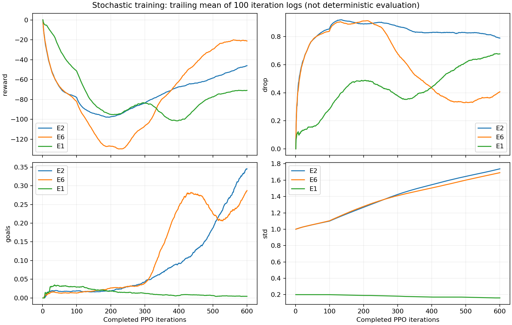

# Уточнение интерпретации ночной лестницы

600 итераций были бюджетом отбора гипотез, а не проверкой сходимости. E2 завершился на улучшающемся позднем участке; оснований объявлять его неперспективным или достигшим плато нет. Он остановлен по заданному бюджету.

## E2: средние по непересекающимся окнам из 100 итераций

| Итерации | std | reward | training drop | training целей/эп | длина эпизода |
|---|---:|---:|---:|---:|---:|
| 1–100 | 1.099 | -77.98 | 0.856 | 0.019 | 429.8 |
| 101–200 | 1.268 | -97.52 | 0.890 | 0.018 | 533.9 |
| 201–300 | 1.425 | -83.63 | 0.875 | 0.043 | 601.0 |
| 301–400 | 1.544 | -67.34 | 0.829 | 0.093 | 748.2 |
| 401–500 | 1.646 | -58.43 | 0.828 | 0.187 | 783.0 |
| 501–600 | 1.738 | -45.99 | 0.790 | 0.345 | 815.3 |

Это усреднение строк лога, без взвешивания по числу завершённых эпизодов. Между первыми двумя окнами reward/drop ухудшались; поздний участок улучшается. Точки отдельных итераций заметно шумят: 0.579 drop на последней итерации не означает 0.579 в среднем на последней сотне (там 0.790).

Training drop и детерминированный drop — разные измерения. Конечный детерминированный drop E2 0.641 против 0.078 у исходной политики остаётся фактом, но не описывает направление обучения и не служит причиной остановки. Исходная политика также завершала 0.039 целей/эпизод, поэтому буквально «ничего не делает» — неточное описание.

E5 проверил 10° только в режиме std0.2 / entropy0: вариант 10° + исследование оставался неизмеренным. Результат E5 не опровергает этот вариант.

E3 тоже имел held выше 0.28 (0.289), хотя std уменьшался. Поэтому утверждение «только E2 и E6 выше 0.28» неверно. Исследование — наиболее перспективный рычаг этой лестницы, но его единственность и универсальное превосходство не доказаны.

gamma=0.998 исключён из следующего плана. Итоги E1/E6 не дают оснований предпочесть его E2; они не доказывают универсальную вредность gamma=0.998 в других бюджетах или режимах.

Продолжение: reports/e2_continuation.md; logs/e2_continuation/state.json. E2 получает ещё 3000 итераций без изменения PPO/задачи. Сохранён adaptive LR 0.00011390625, а не конфиговый 0.001: upstream load() восстанавливает Adam, но не поле PPO.learning_rate. Исправление выполнено в локальном train.py, без правки RSL-RL. Затем отдельный 600-итерационный опыт 10° + std1 + entropy0.005.
